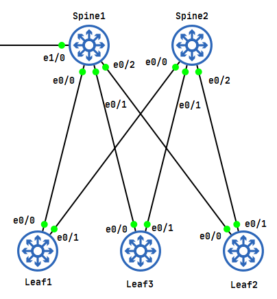
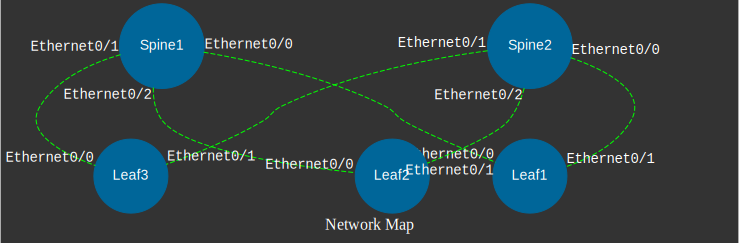

#### Установка
```
git clone https://github.com/gtarada/devnet.git
cd ./task_3
pip install -i requirements.txt
```

#### Запуск
```
python ./save_topology.py
```

#### Описание
Скрипт собирает данные о LLDP соседях с устройств описанных в inventory/hosts.yaml и записывает информацию в текстовом виде в файл topology.csv, в графическом в img/topology.svg

#### Тестовая топология


#### Тестовый вывод
```
Spine1,Ethernet0/2,Leaf2,Ethernet0/0
Spine1,Ethernet0/0,Leaf1,Ethernet0/0
Spine1,Ethernet0/1,Leaf3,Ethernet0/0
Spine2,Ethernet0/2,Leaf2,Ethernet0/1
Spine2,Ethernet0/1,Leaf3,Ethernet0/1
Spine2,Ethernet0/0,Leaf1,Ethernet0/1
```


